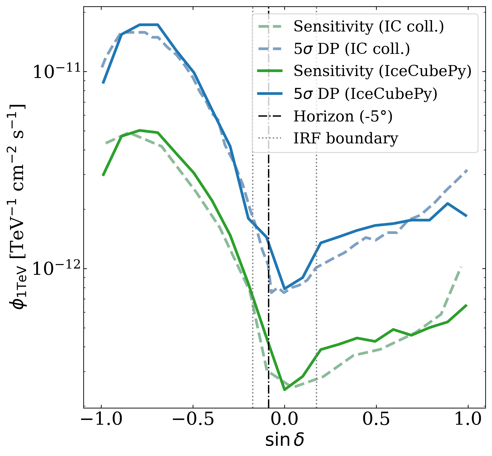

# Welcome to IceCubePy
IceCubePy is an open-source, Python framework to perform general maximum likelihood analysis of IceCube point-source data. It is designed to facilitate the analysis of the publicly released, [IceCube 10-year muon-track dataset](https://icecube.wisc.edu/data-releases/2021/01/all-sky-point-source-icecube-data-years-2008-2018/), while at the same time enabling reproducibility of scientific findings (following [FAIR principles](https://www.nature.com/articles/sdata201618)).

## Introduction
The IceCube collaboration has released to the community an all-sky muon-track dataset that enables searches for point-like neutrino sources. It comprises track-like neutrino candidate events collected between April 2008 and July 2018 [2], forming the basis for the 10‑year time‑integrated point‑source analysis published in [1]. This makes it the most sensitive public dataset for neutrino point-source studies, available to the scientific community to date. 

## IceCubePy framework
IceCubePy provides the users with a ready-to-use Python framework to simplify the loading, handling, and statistical analysis of the public 10-year all-sky data, streamlining the study of candidate astrophysical neutrino sources. IceCubePy implements an unbinned maximum likelihood method, see [Braun et al., Astropart.Phys.29:299-305,2008](https://doi.org/10.1016/j.astropartphys.2008.02.007). 

### Performance evaluation
The IceCubePy sensitivity and discovery potential have been evaluated as a function of declination, for a point-source with spectral index = 2.0. These are in agreement with those published by the IceCube collaboration [[1]](https://doi.org/10.1103/PhysRevLett.124.051103). Some deviations can be attributed to the limited accuracy of the released instrument response functions (IRFs) provided with the public data.

<table>
<tr>
<td></td>
</tr>
</table>

### Developers and more
IceCubePy has been supported by the [MessMapp](https://messmapp.github.io/) project. Contributions and testing from the community are welcome. Currently, source code access may be granted upon request. Contact: [MessMapp website](https://messmapp.github.io/).

### References
[1] Time-integrated Neutrino Source Searches with 10 years of IceCube Data, [Phys. Rev. Lett. 124, 051103 (2020)(https://ui.adsabs.harvard.edu/abs/2020PhRvL.124e1103A/abstract)

[2] IceCube Data for Neutrino Point-Source Searches: Years 2008-2018, https://arxiv.org/abs/2101.09836
