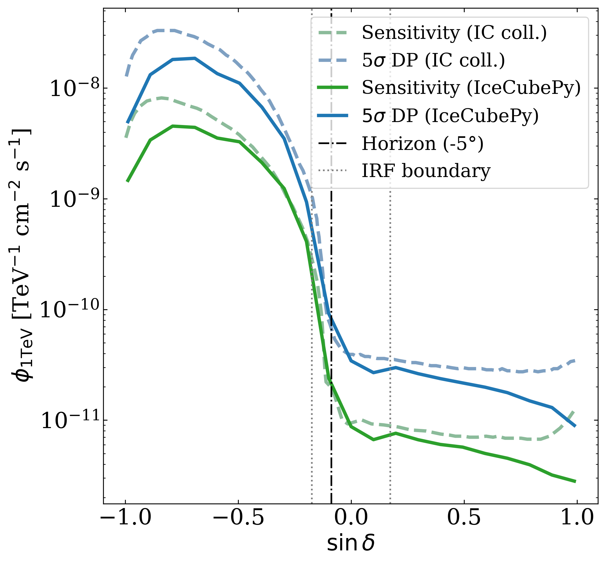

# IceCubePy
A python software for the analysis of IceCube public data, developed within the [MessMapp](https://messmapp.github.io/) project. If you are interested in testing a pre-release version of the code, contact us through the [MessMapp website](https://messmapp.github.io/) (top right corner).

## Introduction
IceCubePy is a soon-to-be open-source software for the analysis of the IceCube public data. Being the most sensitive neutrino dataset available to the community, its study of great interest to the astrophysics community. IceCubePy aims to facilitate the study of candidate astrophysical neutrino sources, enabling reproducibility of findings (FAIR principles).

IceCubePy implements an unbinned maximum likelihood method, see [Braun et al., Astropart.Phys.29:299-305,2008](https://doi.org/10.1016/j.astropartphys.2008.02.007). IceCubePy currently supports the 10-year point source tracks data release, documented in [Aartsen et al., Phys.Rev.D 102, 032004 (2020)](https://doi.org/10.21234/CPKQ-K003). 

## Comparison with IceCube collaboration results
The IceCubePy sensitivity has been evaluated as a function of declination and here is compared with the sensitivity reported by the IceCube collaboration in [Aartsen et al., Phys. Rev. Lett. 124, 051103 (2020)](https://doi.org/10.1103/PhysRevLett.124.051103).

<table>
<tr>
<td></td>
<td></td>
</tr>
</table>

The obtained sensitivities are in agreement with IceCube. Some deviations can be attributed to the limited accuracy of the released instrument response functions (IRFs) accompanying the public data.

